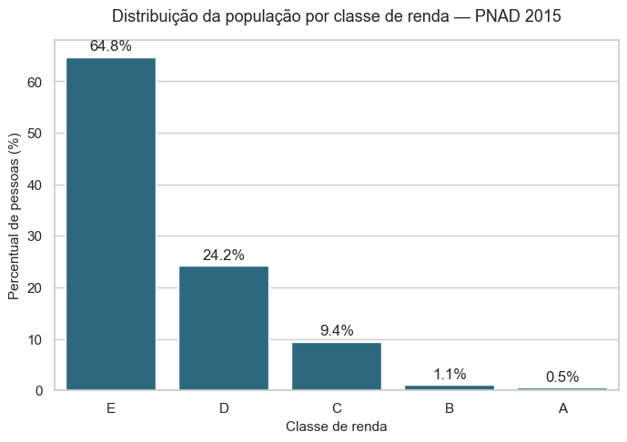
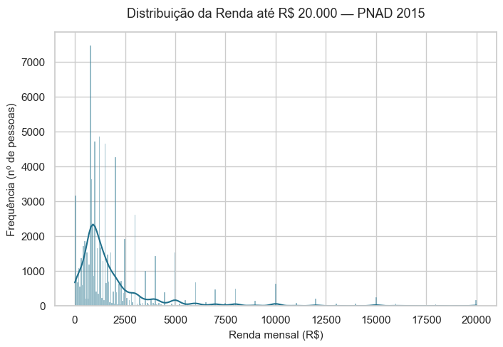
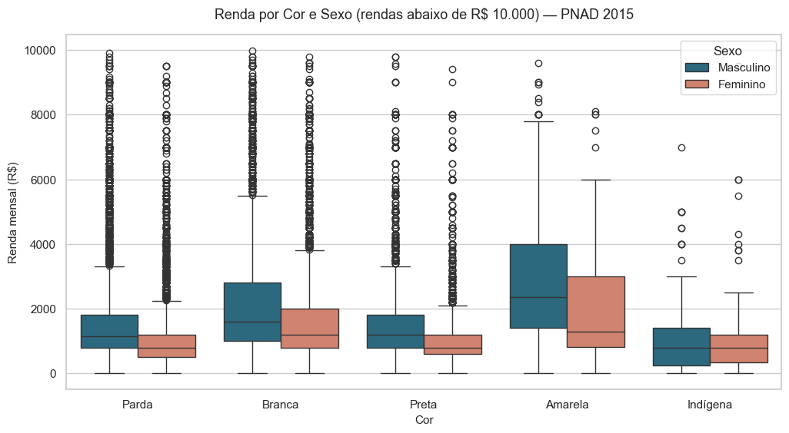
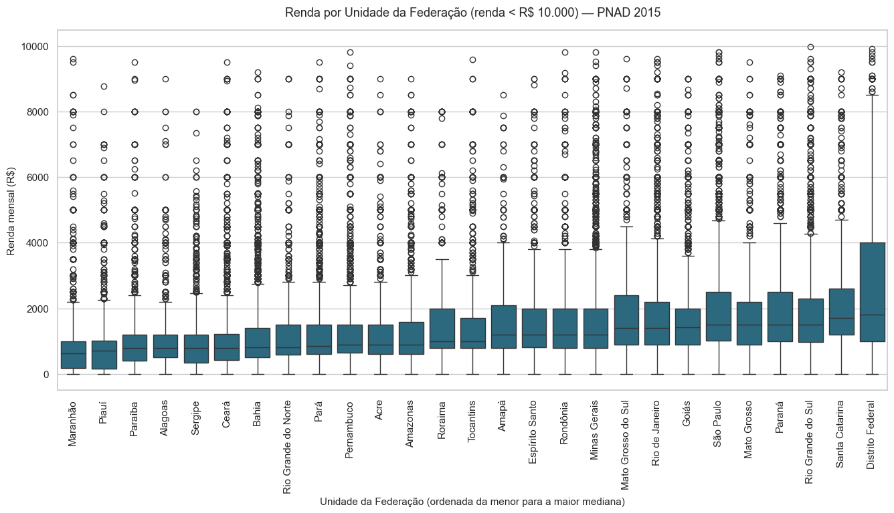

# 📊 Análise Descritiva — PNAD 2015

> Uma investigação estatística sobre a **desigualdade de renda no Brasil**, a partir dos microdados da Pesquisa Nacional por Amostra de Domicílios 2015 (IBGE).


---

## ⚡ TL;DR

Análise descritiva de **76.840 registros** da PNAD 2015 que revela:

- **64,8%** dos brasileiros estão na classe de renda mais baixa (até 2 salários mínimos)
- **99%** das pessoas ganham até R\$ 15.000 — o 1% restante chega a R\$ 200.000
- O homem branco ganha **2,1×** a renda mediana da mulher negra
- Desigualdade regional: o Distrito Federal tem renda mediana **2,9×** maior que a do Maranhão

---

## 🎯 Sobre o projeto

Este é o meu **primeiro projeto real de análise de dados** — desenvolvido como trabalho final do curso *"Estatística com Python: Frequências e Medidas"* (Alura) e transformado em peça de portfólio.

O objetivo foi percorrer o ciclo completo de uma **análise descritiva**: explorar os dados, agrupá-los, visualizá-los, calcular medidas estatísticas e — o mais importante — **interpretar o que os números dizem sobre a sociedade brasileira**.

A pergunta que guia o projeto é simples:

> **Como a renda do trabalho se distribui entre os brasileiros — e essa distribuição é a mesma entre sexos, cores, níveis de escolaridade e estados?**

## 📂 Os dados

A base reúne **76.840 registros** das *pessoas de referência* dos domicílios (os responsáveis), com 7 variáveis: Renda, Idade, Altura, UF, Sexo, Cor e Anos de Estudo. O salário mínimo vigente em 2015 era de **R\$ 788,00** — referência usada em toda a análise.

📄 O detalhamento completo das variáveis, dos tratamentos e da metodologia está em **[DOCUMENTACAO.md](DOCUMENTACAO.md)**.

---

## 🔍 Principais achados

### 1. Dois em cada três brasileiros estão na base da pirâmide



Agrupando a população em classes de renda (de A a E), **64,8% das pessoas estão na classe E** — ganham até 2 salários mínimos. Somada à classe D, essa fatia chega a **88,9%**: quase nove em cada dez responsáveis por domicílio ganhavam até 5 salários mínimos. No outro extremo, as classes A e B juntas representam apenas **1,6%**.

O gráfico não desenha uma escada suave de desigualdade — desenha um **degrau abrupto**.

### 2. A renda é tão concentrada que a média "mente"



A renda **média** é de R\$ 2.000, mas a **mediana** é de apenas R\$ 1.200 — e a **moda** (valor mais comum) é exatamente R\$ 788, o salário mínimo. Quando essas três medidas estão tão distantes, há um sinal claro de **assimetria**: o coeficiente de assimetria da renda é de **15,6** (uma distribuição simétrica fica entre -0,5 e 0,5).

Um grupo minúsculo de altíssima renda puxa a média para cima. Na prática: **99% das pessoas ganham até R\$ 15.000** — o 1% restante se espalha dali até R\$ 200.000. O topo ocupa, sozinho, uma faixa de renda maior que a dos 99% abaixo dele.

### 3. Raça e gênero: duas desigualdades que se somam



A desigualdade não é única — ela se **empilha**. Em todos os grupos de cor, o homem tem renda mediana maior que a da mulher da mesma cor. E, entre os grupos, brancos ganham mais que pardos e pretos.

Combinando os dois efeitos: a renda mediana do **homem branco (R\$ 1.700)** é **2,1 vezes** a da **mulher preta ou parda (R\$ 800)**. Quem é, ao mesmo tempo, mulher e negra carrega as duas desvantagens somadas.

### 4. Estudar paga — mas não paga igual

A escolaridade é a variável que mais movimenta a renda: entre os homens, a mediana sobe de R\$ 700 (sem instrução) para R\$ 4.000 (15 anos ou mais de estudo). Estudar **funciona**.

Mas não funciona igual para todos. Em **todos os 17 níveis** de escolaridade, o homem ganha mais que a mulher de mesma formação. O dado mais duro:

> Um homem com **8 anos** de estudo tem a mesma renda mediana de uma mulher com **13 anos** de estudo.
> Para alcançar o mesmo rendimento, a mulher precisa estudar cerca de **5 anos a mais**.

E esse padrão se mantém mesmo quando comparamos apenas pessoas da **mesma idade** — ou seja, não é um efeito de tempo de carreira.

### 5. O CEP também define a renda



A desigualdade tem mapa. Ordenados pela renda mediana, os estados formam um gradiente: as menores rendas concentram-se no **Nordeste** e no **Norte**; as maiores, no **Sul**, **Sudeste** e **Centro-Oeste**.

O Distrito Federal lidera (mediana de R\$ 2.000) e o Maranhão fecha a lista (R\$ 700) — uma diferença de **2,9 vezes**. No Maranhão e no Piauí, a renda mediana é **inferior ao salário mínimo**: mais da metade dos responsáveis por domicílio ganhava menos de um salário mínimo com o trabalho principal.

---

## 🧭 Conclusão

A desigualdade de renda no Brasil de 2015 não é um fenômeno único, mas a **sobreposição de várias camadas**: uma base social larguíssima, um topo minúsculo e concentrado, e diferenças sistemáticas de **gênero**, **raça**, **escolaridade** e **região**. A análise descritiva não prova as causas dessas diferenças — mas mostra, com clareza, que elas existem e se reforçam.

> ⚠️ Todas as conclusões deste projeto descrevem **associação**, não **causa**, e se referem às *pessoas de referência* dos domicílios e ao *rendimento do trabalho principal*. As ressalvas completas estão registradas no notebook e em [DOCUMENTACAO.md](DOCUMENTACAO.md).

---

## 🛠️ Stack utilizada

| Ferramenta | Uso |
|---|---|
| **Python 3.11+** | Linguagem base |
| **Pandas** | Manipulação de dados e tabelas |
| **NumPy** | Operações numéricas |
| **Seaborn** | Visualizações estatísticas |
| **Matplotlib** | Ajuste fino dos gráficos |
| **SciPy** | Funções estatísticas (percentis) |
| **Jupyter** | Notebook interativo |

## 📁 Estrutura do repositório

```
analise-descritiva-pnad-2015/
├── README.md                    # Este arquivo — a história dos achados
├── DOCUMENTACAO.md               # Documentação técnica e metodológica
├── requirements.txt              # Dependências do projeto
├── data/
│   └── dados.csv                 # Dataset PNAD 2015 (76.840 registros)
├── notebooks/
│   └── analise_descritiva.ipynb  # Análise completa, célula a célula
└── images/                       # Gráficos principais exportados
```

## ▶️ Como executar

```bash
# 1. Clone o repositório
git clone https://github.com/RickelmeDSC/analise-descritiva-pnad-2015.git
cd analise-descritiva-pnad-2015

# 2. Instale as dependências
pip install -r requirements.txt

# 3. Abra o notebook
jupyter notebook notebooks/analise_descritiva.ipynb
```

> 💡 No notebook, use **"Restart & Run All"** para executar todas as células na ordem correta.

---

## 🎓 O que aprendi com este projeto

- **Pandas:** `read_csv`, `cut`, `value_counts`, `crosstab`, `groupby` + `agg`, `query`, `quantile`
- **Visualização:** quando usar histograma, gráfico de barras ou box plot — e por quê
- **Estatística aplicada:** medidas de tendência central, separatrizes, dispersão e assimetria
- **Storytelling com dados:** transformar tabelas em narrativa interpretável
- **Rigor analítico:** distinguir associação de causalidade e declarar as ressalvas

---

## 👤 Autor

**Rickelme David** — em transição de carreira para Análise de Dados.

[](https://github.com/RickelmeDSC)
[](https://www.linkedin.com/in/rickelme-david-75630b203/)

---

## 📚 Fonte dos dados

Pesquisa Nacional por Amostra de Domicílios — PNAD 2015, IBGE.
Dataset utilizado no curso *"Estatística com Python: Frequências e Medidas"* (Alura).
