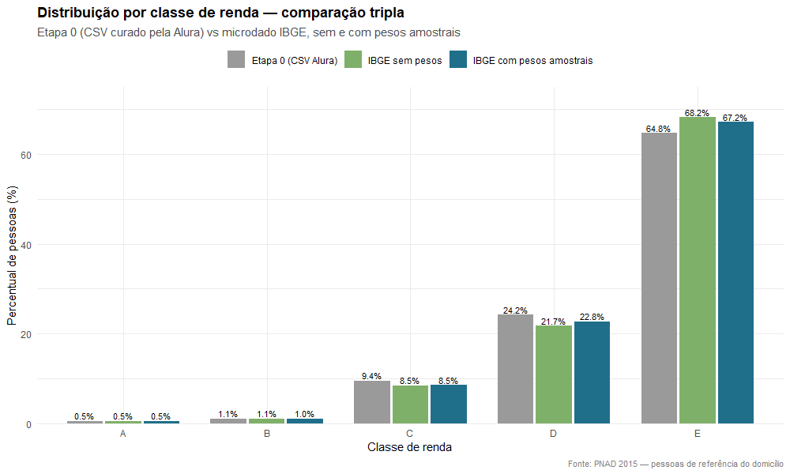
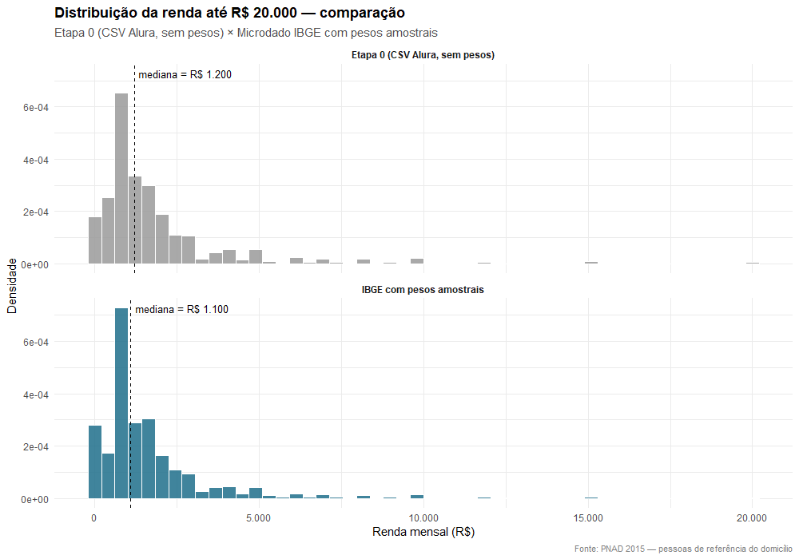
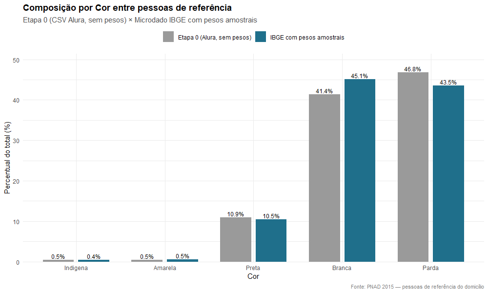
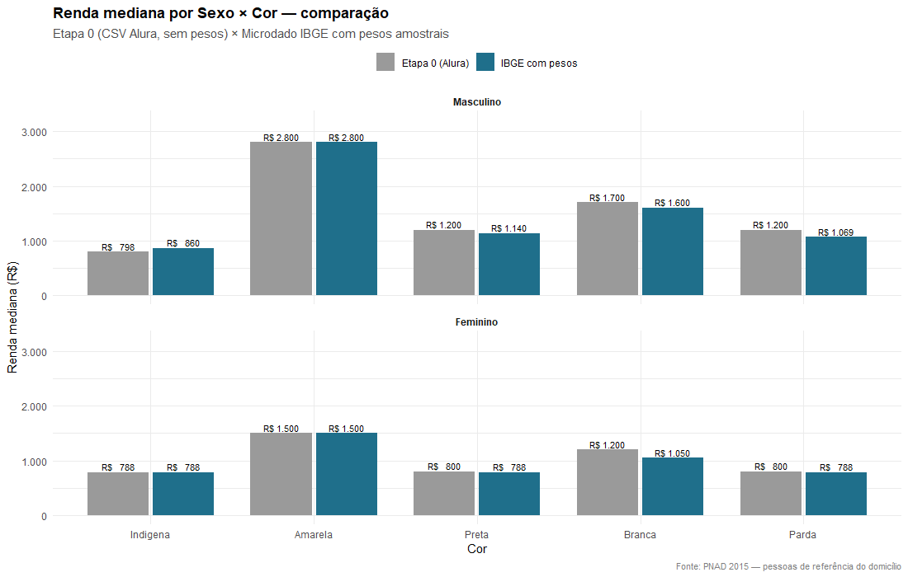
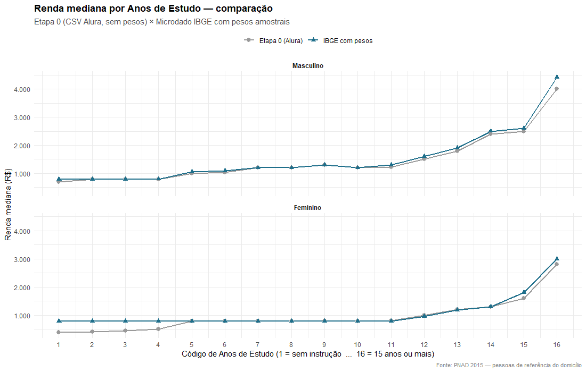
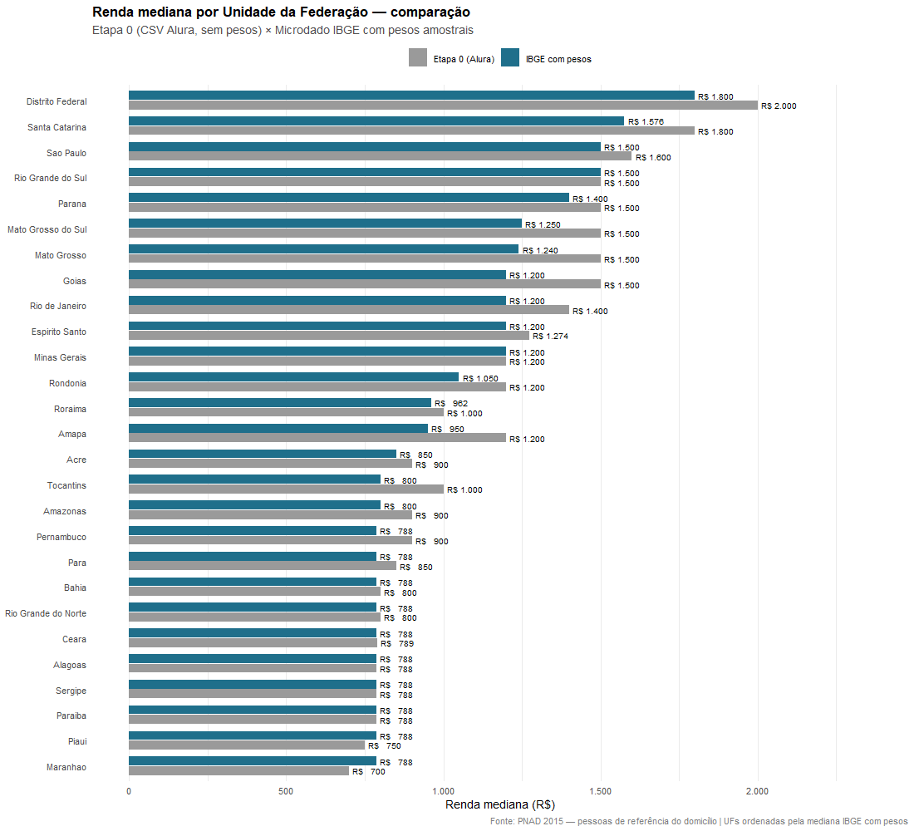

# Resumo da Etapa 1 — Análise PNAD 2015 com Pesos Amostrais

> Documento de fechamento da Etapa 1. Consolida os 6 achados principais da análise feita sobre os microdados oficiais do IBGE com pesos amostrais aplicados via pacote `survey` do R, em resposta à provocação técnica da economista **Tanise Brandão** (PhD em Economia).
>
> Para detalhes metodológicos (origem dos dados, escolhas de design, limitações), ver [NOTAS_METODOLOGICAS.md](NOTAS_METODOLOGICAS.md).

---

## Como começou

Na Etapa 0 deste projeto, fiz uma análise descritiva da PNAD 2015 em Python, usando o CSV curado distribuído pela Alura como exercício de curso. O post foi pro LinkedIn em maio de 2026. Nos comentários, a **Tanise Brandão** apontou que a análise usava a **amostra bruta**, sem aplicar os pesos amostrais da PNAD, e sugeriu o pacote `survey` do R.

A Etapa 1 é a resposta a essa observação: refazer toda a análise sobre os **microdados oficiais do IBGE** (não mais o CSV curado), em R, aplicando os pesos. A intuição original da Tanise se confirmou — mas o que apareceu pelo caminho foi mais rico do que esperávamos.

---

## A surpresa metodológica

O primeiro achado nem era o objetivo da etapa. Quando carregamos o microdado oficial do IBGE com os filtros documentados (pessoa de referência + renda válida), apareceram **116.467 registros**. O CSV da Etapa 0 tinha **76.840**.

Mesmo após testar todos os filtros plausíveis (idade mínima, exclusão de "sem declaração", renda > 0, etc.), sobrou um gap de ~30 mil registros sem explicação documentada. A conclusão honesta: o CSV da Alura é uma **subamostra curada** do microdado IBGE, com filtros que não são públicos.

> Isso significa que a Etapa 1 **não é uma correção da Etapa 0** no sentido estrito. É uma análise nova, sobre uma fonte diferente (e oficial). Os números do IBGE são, daqui pra frente, a referência.

A partir disso, o método foi:
- **Fonte:** microdados PNAD 2015 IBGE (FTP oficial)
- **Linguagem:** R 4.6, pacote `survey` + wrapper `srvyr`
- **Design amostral:** simplificado (`ids = 1, weights = V4729`) — corrige médias e proporções para a população; variâncias usariam o design completo. Decisão registrada em [NOTAS_METODOLOGICAS.md](NOTAS_METODOLOGICAS.md).

---

## Os 6 achados principais

### 1. A base da pirâmide é maior do que parecia

A classe E (até 2 salários mínimos) passou de 64,8% (Etapa 0) para **67,2%** (IBGE com pesos). São **+2,4 pontos percentuais** que mudam a forma do retrato:

| Classe | Etapa 0 (Alura) | IBGE com pesos | Δ |
|---|---:|---:|---:|
| **E** | 64,8% | **67,2%** | **+2,4 pp** |
| D | 24,2% | 22,8% | −1,4 pp |
| C | 9,4% | 8,5% | −0,9 pp |
| B | 1,1% | 1,0% | −0,1 pp |
| A | 0,5% | 0,5% | 0 |

Em números absolutos populacionais, são **45,2 milhões de domicílios** na classe E. A base não é só a maior — é maior do que a Etapa 0 mostrava.

---

### 2. A forma da distribuição confirma a intuição da Tanise — mas a mediana cai

Visualmente, os histogramas mantêm o mesmo formato: assimetria forte à direita, cauda longa, concentração nas rendas baixas. A intuição original da Tanise *"a forma sustenta-se, mas os valores absolutos mudam"* aparece exatamente assim.

A diferença sutil — e importante: o **pico do histograma IBGE com pesos é mais agudo e mais à esquerda**. A concentração é ainda mais intensa nas rendas próximas ao salário mínimo do que a Etapa 0 sugeria.

| Métrica | Etapa 0 | IBGE com pesos |
|---|---:|---:|
| Mediana | R$ 1.200 | R$ 1.100 (−8%) |
| Pico do histograma | ~R$ 1.000–1.500 | ~R$ 600–1.100 |

---

### 3. A composição demográfica muda — não só ajusta

Aqui aparece o primeiro caso em que aplicar pesos **não muda só valores, muda a hierarquia entre categorias**:

**Por sexo (% de pessoas de referência):**

| | Etapa 0 | IBGE com pesos |
|---|---:|---:|
| Masculino | 69,3% | **60,4%** (−8,9 pp) |
| Feminino | 30,7% | **39,6%** (+8,9 pp) |

Quase **40% dos responsáveis por domicílio em 2015 eram mulheres** — não 30%. A Alura subestimou a participação feminina em 9 pontos percentuais.

**Por cor — a hierarquia se inverte:**

| Cor | Etapa 0 | IBGE com pesos |
|---|---:|---:|
| **Branca** | 41,4% | **45,1%** (+3,7 pp) |
| **Parda** | **46,8%** | 43,5% (−3,2 pp) |
| Preta | 10,9% | 10,5% |
| Amarela | 0,5% | 0,5% |
| Indígena | 0,5% | 0,4% |

Na Etapa 0, a maior fatia isolada era **parda**. No IBGE oficial, é **branca** (por pouco). A narrativa do Brasil "predominantemente pardo" continua válida (pardos + pretos + indígenas = 54%), mas o ranking entre cores isoladas inverte.

---

### 4. A dupla desvantagem (gênero × raça) se intensifica

Oito das dez medianas caem ao aplicar pesos. As duas quedas mais marcantes:

| Grupo | Etapa 0 | IBGE com pesos | Δ |
|---|---:|---:|---:|
| Mulher Branca | R$ 1.200 | R$ 1.050 | **−12,5%** |
| Homem Pardo | R$ 1.200 | R$ 1.069 | **−10,9%** |

E a hierarquia "homem branco > mulher negra" fica ainda mais nítida:

> Homem branco mediano: **R$ 1.600**
> Mulher preta ou parda mediana: **R$ 788** (salário mínimo)
> Razão: **2,03×**

Mulheres pretas, pardas e indígenas — **todas** com mediana exatamente igual ao salário mínimo. O piso institucional virou patamar pra três das cinco categorias femininas de cor.

---

### 5. O "platô institucional" feminino na escolaridade

Este foi talvez o achado mais perturbador. No painel feminino do gráfico, a linha azul (IBGE com pesos) fica **horizontal em R$ 788 do código 1 ao 11** — ou seja, da "sem instrução" até "10 anos de estudo completos".

> **Para mulheres com até 10 anos de estudo, a mediana de renda É o salário mínimo, independentemente da escolaridade.**
> A "escada da escolaridade" da Etapa 0 (sugeria que cada ano de estudo aumentava a renda) era artefato do CSV curado da Alura.

Só a partir do ensino médio completo (código 12 = 11 anos de estudo) a renda feminina começa a se mover acima do mínimo.

**Para homens, o cenário é diferente:** as linhas Etapa 0 e IBGE estão quase sobrepostas — a escada progressiva existe e funciona desde o primeiro ano de estudo.

Resumo brutal:

> **Homens:** estudar paga progressivamente, desde o primeiro ano.
> **Mulheres:** estudar até 10 anos não move a renda mediana do salário mínimo. Só a partir do ensino médio completo o estudo começa a remunerar.

---

### 6. Dez estados brasileiros têm mediana = salário mínimo

O ranking das UFs pela renda mediana, quando refeito com pesos amostrais, mostra uma "linha vertical perfeita" no R$ 788:

**As 10 UFs do fundo da tabela:**

| UF | Etapa 0 | IBGE com pesos |
|---|---:|---:|
| Alagoas | 788 | **788** |
| Bahia | 800 | **788** |
| Ceará | 789 | **788** |
| Maranhão | 700 | **788** |
| Pará | 850 | **788** |
| Paraíba | 788 | **788** |
| Pernambuco | 900 | **788** |
| Piauí | 750 | **788** |
| Rio Grande do Norte | 800 | **788** |
| Sergipe | 788 | **788** |

**Dez estados brasileiros têm mais da metade dos responsáveis por domicílio ganhando exatamente o salário mínimo.** A Etapa 0 mostrava esses estados variando entre R$ 700 e R$ 900, sugerindo distinções; com pesos amostrais, todos colapsam no mesmo piso institucional.

O topo do ranking também cai:

| UF | Etapa 0 | IBGE com pesos | Δ |
|---|---:|---:|---:|
| Distrito Federal | 2.000 | 1.800 | −10% |
| Santa Catarina | 1.800 | 1.576 | −12% |
| Goiás | 1.500 | 1.200 | −20% |

**Razão de desigualdade DF / Maranhão:**
- Etapa 0: **2,86×**
- IBGE com pesos: **2,28×**

Mas atenção: a razão "diminui" porque o salário mínimo absorveu o Maranhão pra cima. A desigualdade não desapareceu — ela se **comprime** no piso institucional pra metade do país.

---

## A síntese

A intuição da Tanise se confirma: a aplicação de pesos amostrais **muda os valores absolutos**. Mas o que descobrimos pelo caminho é mais profundo do que isso.

Em três casos, a aplicação de pesos faz mais do que ajustar números — **revela padrões estruturais** que a amostra bruta escondia:

1. **Inverte hierarquias** (Branca passa a ser maior grupo isolado, não Parda)
2. **Expõe platôs institucionais** (mulheres com até 10 anos de estudo → todas no salário mínimo)
3. **Mostra colapso no piso** (10 UFs convergindo exatamente em R$ 788)

Se a Etapa 0 contava a história "Brasil desigual com escadas de renda diferenciadas", a Etapa 1 mostra que para grandes recortes demográficos (mulheres com baixa escolaridade, dez estados inteiros, três categorias femininas de cor) **a escada simplesmente não existe** — todo mundo está no degrau-piso.

> **Diagnóstico atualizado:** a desigualdade brasileira não é uma escada com muitos degraus, é uma escada com um chão muito grande e um topo distante. O salário mínimo deixou de ser piso para virar **patamar institucional** pra metade do país.

---

## Pontos abertos para revisão

Pontos onde feedback metodológico seria especialmente valioso (registrados também em [NOTAS_METODOLOGICAS.md](NOTAS_METODOLOGICAS.md)):

- [ ] O design amostral simplificado é aceitável para o escopo? Ou evoluir para o design completo com PSU/estrato?
- [ ] V4720 (todas as fontes) é a escolha apropriada de variável de renda? Ou usar V4718 (trabalho principal)?
- [ ] A interpretação do gap Etapa 0 ↔ IBGE como "curadoria não documentada" parece razoável?
- [ ] Existe alguma boa prática específica da literatura econômica que devamos seguir para os próximos cortes?

---

## Sugestão de estrutura pro post de LinkedIn

Um esboço inicial — pra você editar e cortar como achar melhor:

**Gancho (1ª linha):**
> Quando publiquei a análise da PNAD 2015 sem pesos amostrais, a [Tanise Brandão](LinkedIn URL) apontou (com razão) que isso muda os valores absolutos. Refiz tudo em R com `survey`. Encontrei 6 padrões que a versão sem pesos escondia.

**Achados em sequência:**
1. A classe E é 67,2%, não 64,8% — 45 milhões de domicílios no piso
2. A maioria das pessoas de referência **não** é parda (Branca = 45,1% > Parda = 43,5%)
3. Mulheres = **40%** dos chefes de família (não 30%)
4. Mulher branca: renda mediana cai 12,5% ao aplicar pesos
5. Mulheres com até 10 anos de estudo: todas no salário mínimo, independente de educação
6. **10 estados brasileiros** têm mediana = salário mínimo exato

**Fechamento:**
> A intuição da Tanise se confirmou. Mas o que apareceu pelo caminho foi maior: o salário mínimo virou patamar institucional para grandes recortes demográficos.
>
> Código, dados e gráficos completos no repositório: [link]
> Toda a metodologia documentada em [NOTAS_METODOLOGICAS.md](link)

**Marcação obrigatória:** @Tanise Brandão (sem ela, esse post não existe).

---

## Reprodutibilidade

Toda a análise está nos scripts:

| Script | Análise | Imagem gerada |
|---|---|---|
| [`R/setup.R`](R/setup.R) | Carrega pacotes | — |
| [`R/01_carregar_microdados.R`](R/01_carregar_microdados.R) | Leitura e filtros, primeiras estatísticas | — |
| [`R/02_investigar_filtro_alura.R`](R/02_investigar_filtro_alura.R) | Diagnóstico do gap Etapa 0 vs IBGE | — |
| [`R/03_classes_renda.R`](R/03_classes_renda.R) | Classes A–E | `classes_renda_comparacao.png` |
| [`R/04_histograma_renda.R`](R/04_histograma_renda.R) | Histograma | `histograma_renda_comparacao.png` |
| [`R/05_sexo_cor.R`](R/05_sexo_cor.R) | Crosstab Sexo × Cor | `sexo_cor_comparacao.png` |
| [`R/06_renda_sexo_cor.R`](R/06_renda_sexo_cor.R) | Renda por Sexo × Cor | `renda_sexo_cor_comparacao.png` |
| [`R/07_renda_escolaridade.R`](R/07_renda_escolaridade.R) | Renda por Anos de Estudo | `renda_escolaridade_comparacao.png` |
| [`R/08_renda_uf.R`](R/08_renda_uf.R) | Renda por UF | `renda_uf_comparacao.png` |

Ambiente: R 4.6.0, pacotes `survey` 4.5, `srvyr` 1.3.1, `dplyr` 1.2.1, `ggplot2` 4.0.3.

Microdados em `data/microdados_pnad_2015/` (gitignored; baixar do [FTP IBGE](https://ftp.ibge.gov.br/Trabalho_e_Rendimento/Pesquisa_Nacional_por_Amostra_de_Domicilios_anual/microdados/2015/)).
